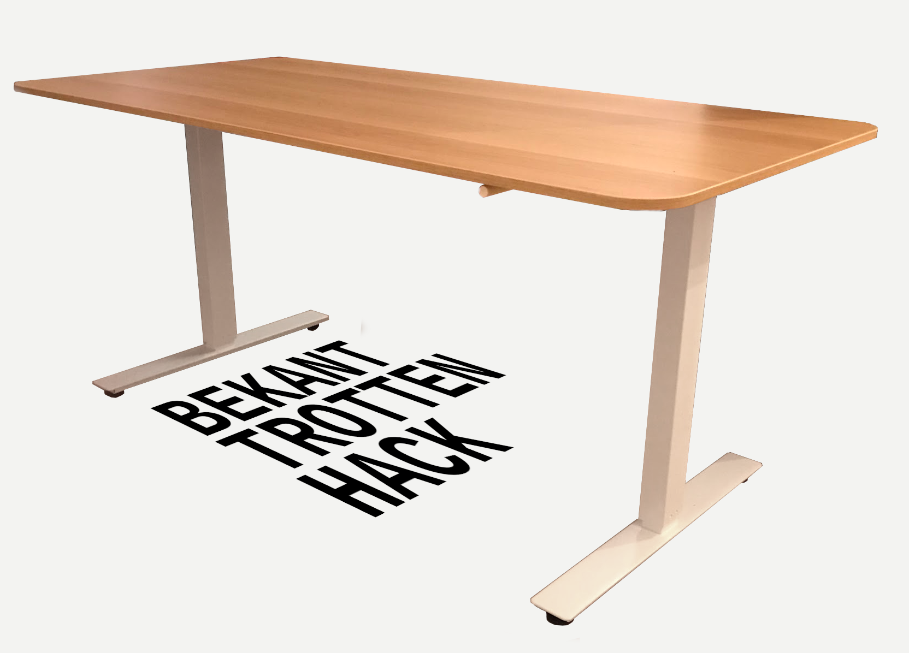

BEKANT / TROTTEN desk hack
===

This is how I've mounted an IKEA BEKANT desk tabletop on an IKEA TROTTEN unmotorized sit/stand underframe.

Instructions
---

The tabletop has 9.5mm holes drilled out for mounting to a matching BEKANT underframe. We ignore these, and instead drill 6.5mm holes, 13mm deep for:

1. 8 mounting holes for the underframe,
2. 4 mounting holes for the underframe crank handle brackets.

You'll have to trace out / transfer these holes yourself. I've measured 106mm and 97mm from tabletop edges (not counting veneer) to edges of the underframe brackets. The locations of the crank handle brackets are up to your preference. The TROTTEN assembly guide should give you inspiration as to what you're trying to do here.

We then use [12 plugs/inserts](inserts.jpg), similar to the plug design used in the original BEKANT underframe/tabletop mounting setup. These go [through the underframe/brackets](mounting.jpg) and into the 6.5mm holes drilled into the tabletop. Then we screw a 4mm chipboard screw into every plug.

Two different plug/screw lengths are used - longer ones for the crank handle brackets, shorter ones for the underframe (this is because the plastic crank handle brackets are thicker than the metal mounting brackets of the main underframe).

**Triple check that you have a correct depth stop set on your drill** - a piece of tape will do fine if you don't have fancy equipment. 13mm is _very_ close to the thickness of the table top, and you _will_ go straight through it if you're not extra careful.

**Note**: The plugs aren't a fantastic design and have a tendency to split when the screws get screwed in. That doesn't matter though, as long as the part that goes into the MDF gets expanded by the screw, and as long as the head of the plug stays in between the screw head and the frame/bracket (it then acts as a washer). The plugs also have a tendency to spin while the screw is screwed in, in that case a hammer maybe used to hammer the screw in instead (as with normal wall anchors/plugs) - or the head of the plug can be held with a pair of pliers.

Bill of Materials
---

| Part                               | Count | Source                |
|------------------------------------|-------|-----------------------|
| BEKANT 160x80 table top            | 1     | IKEA, eg. 003.663.01  |
| TROTTEN sit/stand underframe       | 1     | IKEA, eg. 994.295.78  |
| Insert, 16mm (for underframe)      | 8     | FDM,`insert-16mm.stl` |
| Insert, 18mm (for handle brackets) | 4     | FDM,`insert-18mm.stl` |
| DIN 7507 4x16mm chipboard screw    | 8     | Any hardware store    |
| DIN 7507 4x18mm chipboard screw    | 4     | Any hardware store    |

Note: the FDM parts were only tested on my junk 3d printer that likely isn't dimensionally acurate. Please adjust the dimensions if things don't seem to work well, and feel free to send over adjusted files if your 3d printer is known to be dimensionally accurate.

Note: you can also use 16mm screws in place of the 18mm screws.

Disclaimer
---

No warranty is provided or implied. I'm not a mechanical engineer and I reserve the right to say “I told you so” when the desk spontaneously deconstructs itself.

License
---

This work is ditributed under the [CC0 1.0 Universal license](LICENSE.txt). IKEA, BEKANT and TROTTEN are trademarks of IKEA Systems B.V.. This work is not an official IKEA product.
